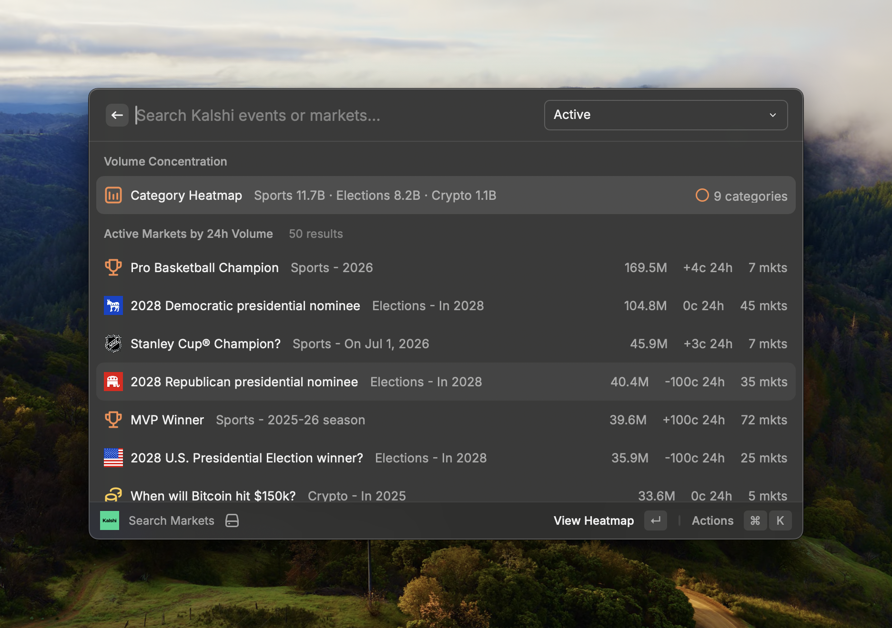

# Kalshi Markets

Browse public Kalshi prediction markets from Raycast. Search active, inactive, and resolved markets; compare option prices; review market charts and rules; and open the corresponding Kalshi page in your browser.



## Features

- Search Kalshi events and markets directly from Raycast.
- Filter by active, inactive, resolved, favorite, and common topic views.
- See market/event imagery and option logos when Kalshi provides them.
- Compare each option's Yes price and 24-hour volume.
- View market charts and rules before opening Kalshi.
- Favorite filters, events, and options with Raycast local storage.

## Setup

No account, API key, or additional command-line tool is required.

This extension reads public Kalshi market data from:

- `https://api.elections.kalshi.com/v1/search/series`
- `https://api.elections.kalshi.com/trade-api/v2`

## Usage

1. Open Raycast and run `Search Markets`.
2. Search for an event or use the filter dropdown.
3. Select a market to view its chart, rules, and option list.
4. Use the action panel to open the market in Kalshi or favorite it.

## Development

```bash
npm install
npm run dev
```

Run a production validation build with:

```bash
npm run build
```
